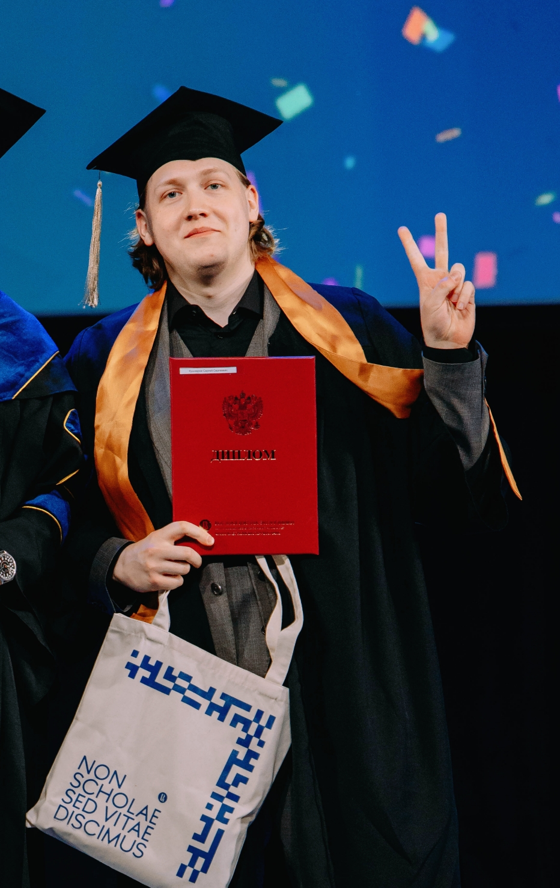

# Sergey Kushneryuk | Gen AI and Machine Learning Research Scientist

This repository contains my [CV](./CV_Sergey_Kushneryuk_eng_0126.pdf) (updated January 2026) and additional information about my background and research interests.

<figure>
    
    <figcaption><i>Master's graduation ceremony, Skoltech/HSE</i></figcaption>
</figure>

## 🔍 Current Focus
- **Primary goal:** PhD programs in Generative AI (Spring/Autumn 2026 intake) focusing on Discrete Diffusion Models and theoretical aspects of dLLMs
- **Open to:** Research scientist positions in Image/Video/3D generation model development, VLM training with focus on model's comprehension of visual data

## 📚 Education
**MSc in Mathematics of Machine Learning** (Graduated with Distinction)  
*Joint program between Skoltech University and HSE University*  
- Thesis: "Improving Diffusion-Based Blind Image Super-Resolution Methods via Invertible Image Transformations"  
  Supervised by [Alexander Korotin](https://scholar.google.ru/citations?user=1rIIvjAAAAAJ&hl=en)

**BSc in Applied Mathematics and Computer Science**  
*Moscow Institute of Physics and Technology (MIPT)*  
- Department of Image Recognition and Text Processing (founded by ABBYY)
- Comprehensive curriculum covering ML, DL, Statistics, NLP, CV, and Generative Models

**Machine Learning Developer Program**  
*Yandex School of Data Analysis (2-year advanced program)*

## 📄 Publications
**One-Step Residual Shifting Diffusion for Image Super-Resolution via Distillation**  
D. Selikhanovych, D. Li, A. Leonov, N. Gushchin, **S. Kushneriuk**, A. Filippov, E. Burnaev, I. Koshelev, A. Korotin  
*Submitted to ICML 2026* | [arXiv:2503.13358](https://arxiv.org/abs/2503.13358)

## 💼 Work Experience
**GenAI Research Scientist** | Noah's Ark Lab, Huawei (Feb 2025 – Present)
- Referring Expression Generation/Comprehension data generation for VLM Training
- Discrete (Text) Diffusion theoretical research
- Diffusion model acceleration and distillation for Blind Image Super-Resolution

**MLE Intern** | Tinkoff AI Center, Applied NLP Team (Summer 2024)
- Trained NER models for text anonymization (PII detection)
- Developed semi-supervised text clustering system

**MLE Intern** | Meteum.AI Team (Summer 2022)
- Improved short-term precipitation prediction models (nowcasting) with user report integration
- Weather forecasting analysis for business applications

**SWE Intern** | Yandex Weather Team (Summer 2021)
- Developed 4 new weather scenarios for voice assistant "Alice"
- Implemented A/B testing frameworks for feature evaluation

## 🏆 Achievements
- **Competitive Programming:** ICPC Northern Eurasia Finals (1/2) in 2023 and 2024, Moscow Regional Contest (1/4) 2020 
- **Olympiads:** "I am Professional" National Olympiad – Winner in Mathematics, Medalist in AI
- **Teaching:** Tutor for competitive programming and mathematics (2020-2021)

## 🎯 Research Interests
- **Primary:** Discrete (Text) Diffusion Models
- **Generative AI:** Diffusion models, GANs, Video/3D generation
- **Theoretical ML:** Stochastic processes, SDEs, Markov Chains
- **Applications:** Mathematical finance, economics
- **Other:** Competitive programming, functional programming, theoretical computer science

## 📱 Contact
- **Email:** [skushneryuk@gmail.com](mailto:skushneryuk@gmail.com)
- **Telegram:** [@skushneryuk](https://t.me/skushneryuk)
- **LinkedIn:** [skushneryuk](https://www.linkedin.com/in/skushneryuk/)
- **CV:** [Download PDF](./CV_Sergey_Kushneryuk_eng_0126.pdf)

## 📝 Note
*My official name (passport) is Sergei Kushneriuk, but I commonly use Sergey Kushneryuk.*
